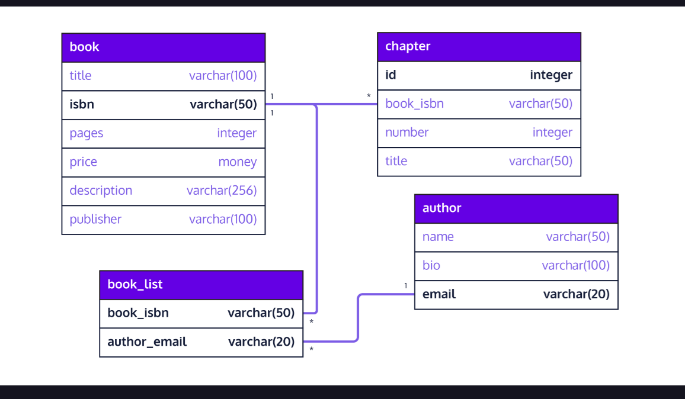

link to lesson
https://www.codecademy.com/paths/design-databases-with-postgresql/tracks/how-do-i-make-and-populate-my-own-database/modules/designing-a-database-schema/lessons/what-is-database-schema/exercises/introduction

### WHAT IS A DATABASE SCHEMA?

## Introduction

Welcome! In this lesson, you will learn what a database schema is and how to create one with PostgreSQL. PostgreSQL is a popular database management system that stores information on a dedicated database server instead of on a local file system. The benefits of using a database system include better organization of related information, more efficient storage and faster retrieval.

Like an architectural blueprint, a database schema is documentation that helps its audience such as a database designer, administrator and other users interact with a database. It gives an overview of the purpose of the database along with the data that makes up the database, how the data is organized into tables, how the tables are internally structured and how they relate to one another.

When designing a database schema consider the following steps:

- Define the purpose of your database
- Find the information that make up the database
- Organize your information into tables
- Structure your tables into columns of information
- Avoid redundant data that leads to inaccuracy and waste in space
- Identify the relationships between your tables and implement them
- The last two items ensure data accuracy and integrity anytime you need to add or update information in the database. It also makes querying the database much more efficient.

You can design database schemas by hand or by software. Here are a few examples of free online database design tools:

- DbDiagram.io - a free, simple tool to draw ER diagrams by just writing code, designed for developers and data analysts.
- SQLDBM - SQL Database Modeler
- DB Designer - online database schema design and modeling tool
On the right is a sample database schema diagram generated from DbDiagram.io. Let’s take a look at what it entails.

The purpose of this database is to maintain a book inventory. The information in the database is organized into four tables and they are book, chapter, author, and book_list. What data are we storing about a book? What is the book_list table used for?

In this particular schema diagram, the symbols 1 and * on the lines denote a one-to-many relationship between these tables:

- book and chapter
- book and book_list
- author and book_list
We will delve into relationships in more detail in a later lesson.

Different database tools illustrate table relationships with different symbols.

Your database schema should contain the following:

- table names
- column names per table
- column types per table
- constraints per table, if any
- relationships between tables, if any
In this lesson, we will focus mainly on the first three items. In subsequent lessons, we will address constraints and relationships.

### Instructions
Click NEXT to continue.
