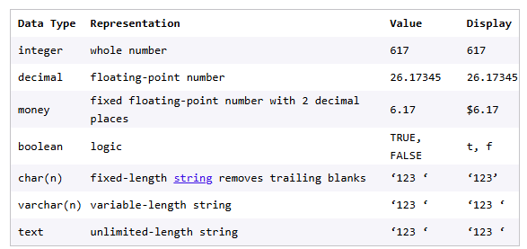

link to the lesson

https://www.codecademy.com/paths/design-databases-with-postgresql/tracks/how-do-i-make-and-populate-my-own-database/modules/designing-a-database-schema/lessons/what-is-database-schema/exercises/creating-your-tableso
https://www.codecademy.com/paths/design-databases-with-postgresql/tracks/how-do-i-make-and-populate-my-own-database/modules/designing-a-database-schema/lessons/what-is-database-schema/exercises/creating-your-tables

### WHAT IS A DATABASE SCHEMA?

## Creating Your Tables

Once we have identified our tables for our schema, the next step is to declare what should be in our tables. A database table is made up of columns of information. Each column is assigned a name and data type. You can see this information represented in the schema diagram from exercise 1.

To create a table in PostgreSQL, we would use the following SQL syntax:

```
CREATE TABLE person (
  first_name varchar(15),
  last_name varchar(15),
  age integer,
  …
  ssn char(9)
);

```

In this example, the table name is person, and its column names include first_name, last_name and ssn. You can think of a column name representing a property, attribute or field in the table. The naming convention that we are using for this course in defining PostgreSQL tables is snake case, which uses lower case letters with underscores between words for columns and table names.

Each column name is associated with a column type which is a data type such as numeric, character, boolean or other interesting types. Here is a summary of common data types, what they represent, their sample values and how they display on Postgres:




Let’s get started in creating our tables for our book inventory database schema from a previous exercise.

### Instructions
Checkpoint 1 Passed
1. Open script.sql. Create a book table with these columns:

title for the book title, a varchar of 100 characters
isbn for the book isbn, a varchar of 50 characters
pages for the number of pages in the book, an integer
price for the book price, of money type
description for the book description, a varchar of 256 characters
publisher for the book publisher name, a varchar of 100 characters
Use upper casing for the CREATE TABLE statement and parentheses (...) to enclose the comma-separated columns, one on its own line. Use snake case when naming your table and columns. End the statement with a semicolon, ;.

Here is an example table:
```
CREATE TABLE person (
  id integer,
  name varchar(100),
  age integer
);

```
In script.sql, create another table, chapter with these columns:

id for a unique chapter identifier, in integer type
number for chapter number, in integer type
title for the chapter title with varchar of 50 characters
content for the chapter content with varchar of 1024 characters.
Checkpoint 3 Passed
3.
Similarly, create the table, author in script.sql with these columns:

name for author name, in varchar of 50 characters
bio for author bio, in varchar of 100 characters
email for author email, in varchar of 20 characters
